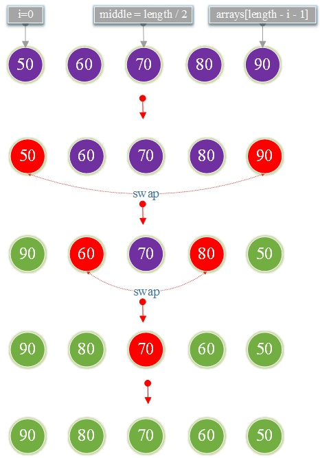

# Reverse Array

Inversion of ordered sequences:

## Algorithmic ideas

Initial `i = 0` and\
then swap the first element `arrays[i]` with last element
`arrays[length - i - 1]`\
Repeat until index of middle `i == length / 2`.

