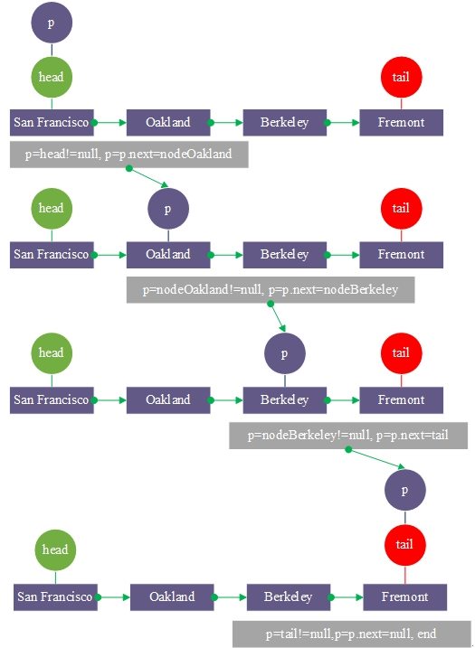
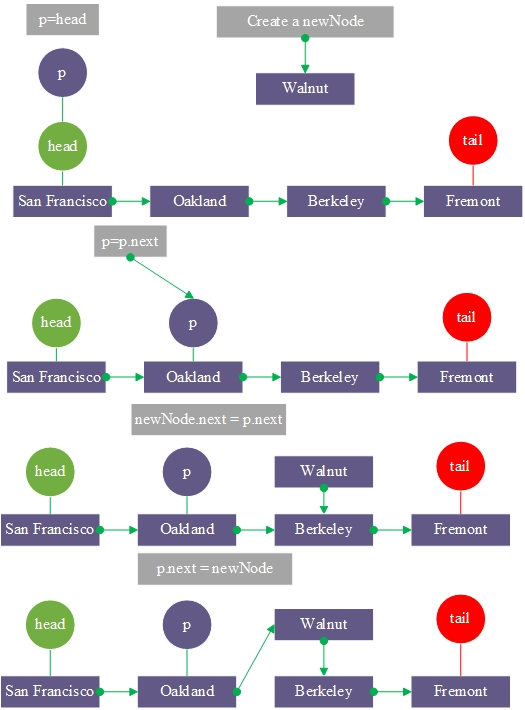
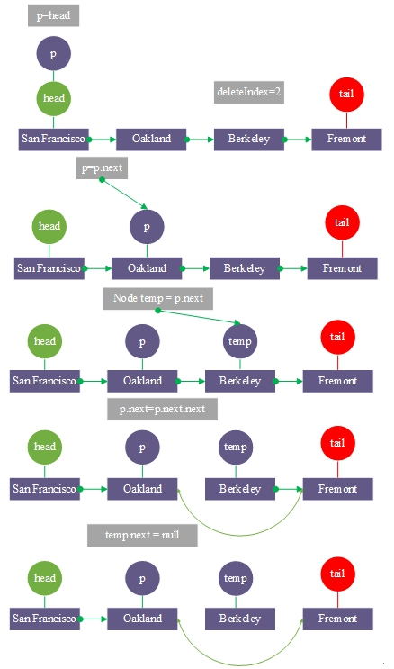

# Unidirectional Linked List

**Unidirectional Linked List Single Link**:
Is a chained storage structure of a linear table, which is connected by a node. Each node consists of data and next pointer to the next node.


UML diagram\


```go
type Node struct {
    data string
    next *Node
}
```

## 1. Unidirectional Linked List Initialization

Example: Construcut a SF subway Unidirectional Linked List


## 2. Traversal output



## 3 Insert a node Walnut in position 2



## 4 Delete the index = 2 node

