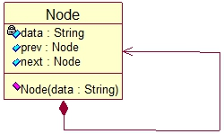
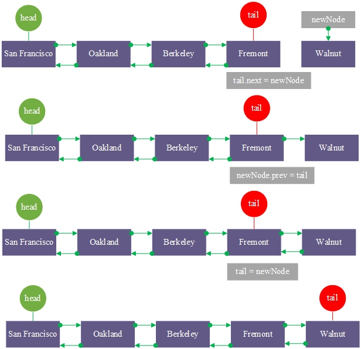
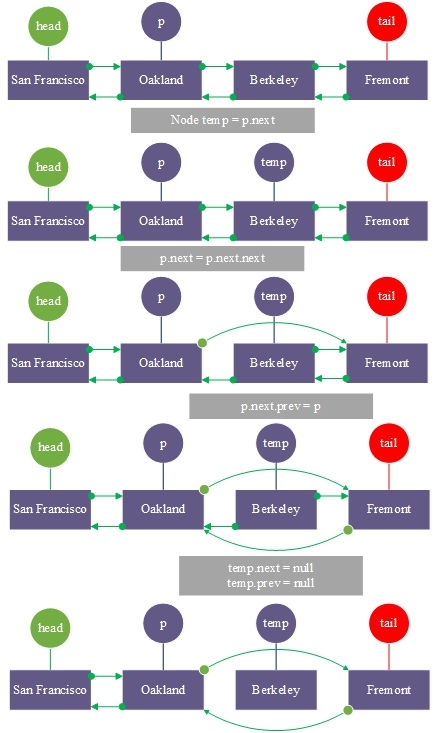

# Doubly Linked List

**Doubly Linked List**:
It is a chained storge structure of a linear table. It is connected by nodes in two directions. Each node consists of data, pointing to the previous node and pointing to the next node.


UML



```go
type Node struct{
    data string
    prev *Node
    next *Node
}

1. Doubly linked list initialization

Example : Construct a SF subway doubly linked list
```

2. Traversal output

3. Add a node Walnut at the end of Fremont



4. Delete the index=2 node

