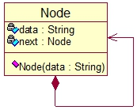
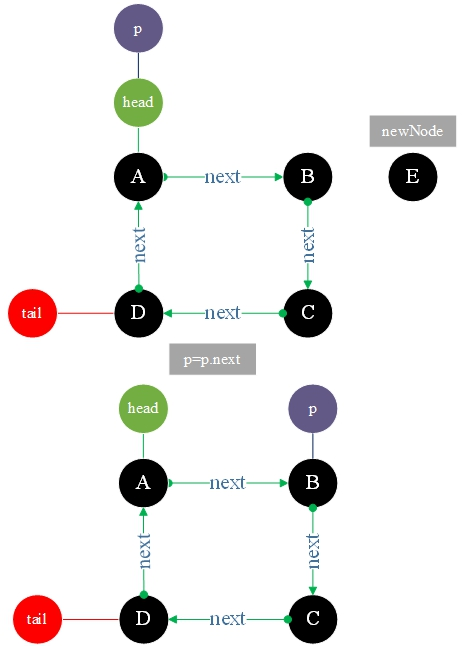

# One-way Circular LinkedList

**One-way Circular List:**: It is a chain storage structure of a linear table, which is connected to form a ring and each node is composed of data and a pointer to next.


UML



```go
type Node struct {
    data string
    next *Node
}
```

1. One-way Circular Linked List initialization and traversal ouput


2. Insert a node E in position 2




3. Delete the index=2 node


