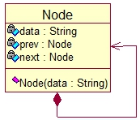

# Two Way Circular Linked List

**Two Way Circular Linked List**: It is a chain storage structure of a linear table. The nodes are connected in series by 2 directions, and is connected to form a ring. Each node is composed of data, pointing to the previous node prev and pointing to the next node next.


UML



```go
type Node struc {
    data string
    prev *Node
    next *Node
}
```

1. Two-way Circular Linked List initialization and traversal output


2. Insert a node E at position 2


3. Delete the index=2 node


