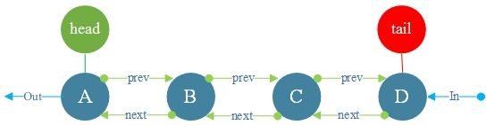
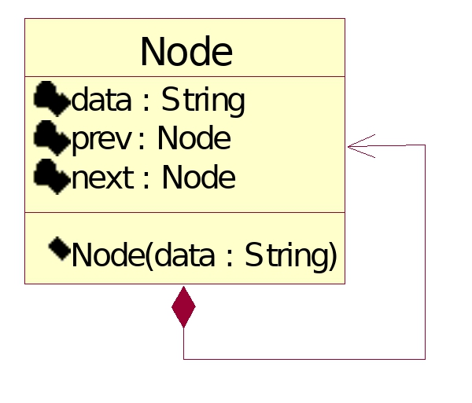

# Queue

**Queue**: FIFO (First In First Out)



UML



```go
type Node struct {
    data string
    prev *Node
    next *Node
}
```
1. Queue initialization and traversal output

Initialization insert A


Initialization insert B


Initialization insert C


Initialization insert D


