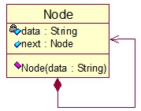

# Stack
**Stack**: LIFO (Last In First Out) sequence


UML



```go
type Node struct{
    data string
    next *Node
}
```

1. Stack initialization and traversal output

Push A into Stack


Push A into Stack


Push C into Stack


If C is poped from Stack


If B is poped from Stack


If A is poped from Stack

