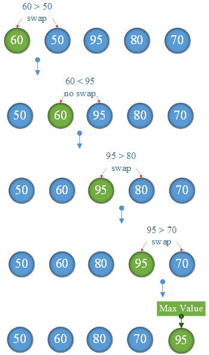

# Maximum value

## Maximum if integer sequences:

$60~50~95~80~70$

1. **Algorithmic ideas**

Compare `arrays[i]` with `arrays[i+1]`,\
if `arrays[i] > arrays[i+1` are exchanged.\
So continue until the last number, `arrays[len-1]` is the maximum

