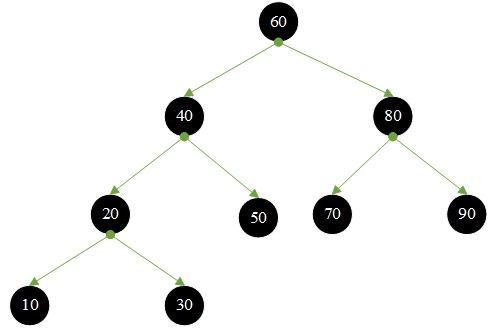
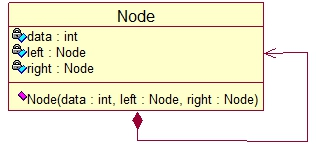

# Binary search tree

A tree is a binary search tree if:

1. The left subtree of any node is not empty, the value of all nodes on the left subtree is less than the value of its root node
2. The right subtree of any node is not empty, the value of all nodes on the right subtree is greater than the value of its root node
3. The left subtree and the right subtree of any node are also binary searh trees



Node UML diagram



```go
type Node struct {
    data int
    left *Node
    right *Node
}
```

## Binary search tree In-order traversal

In order traversal : left subtree $\rarr$ root node $\rarr$ right subtree


Result


