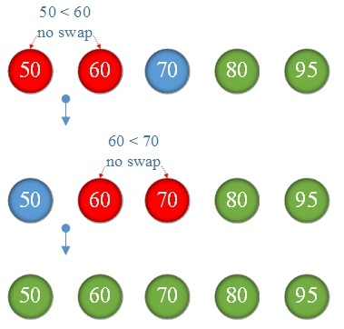

# Bubble sorting algorithm

## Bubble sorting algorithm:

Compare `arrays[j]` with `arrays[j+1]`
if `arrays[j] > arrays[j+1]` they are exchanged
Remaining elements repeat this process, until sorting is completed.!

1st sorting\

2nd sorting\

3rd sorting\

There is no swap after that so we terminate the sorting.
