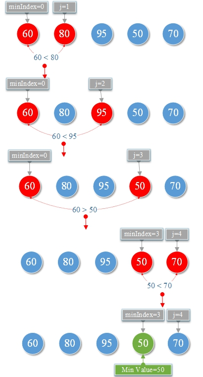

# Minimum value

Algorithmic ideas
Initial value `minIndex=0`, `j=1` Compare `arrays[minIndex]` with `arrays[j]`\
if `arrays[minIndex] > arrays[j]` then minIndex=j, `j++` else `j++`. continue until the last number, `arrays[minIndex]`is the Min Value.

