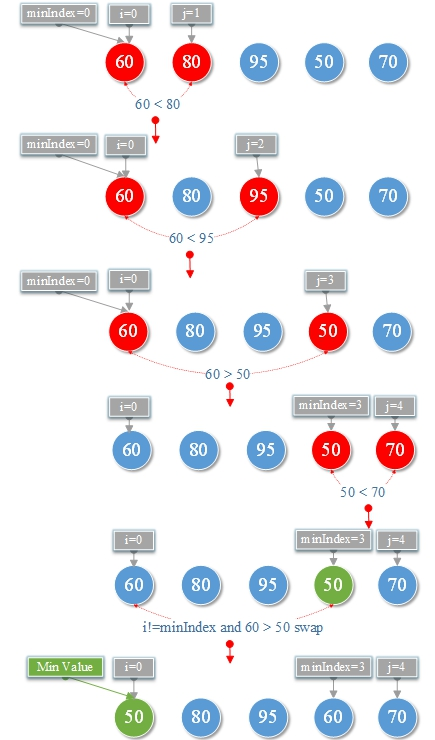
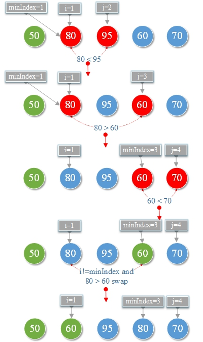
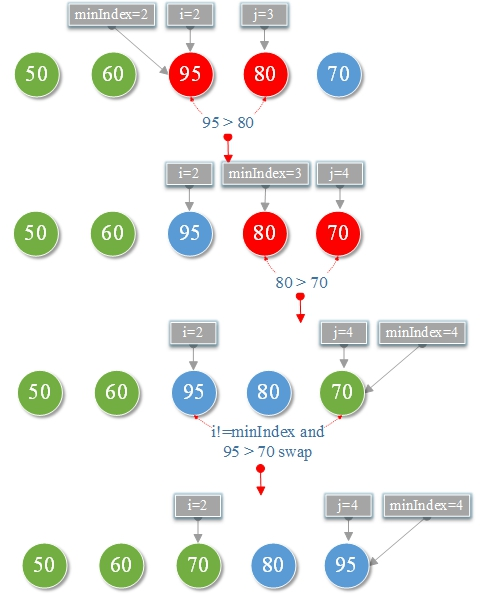
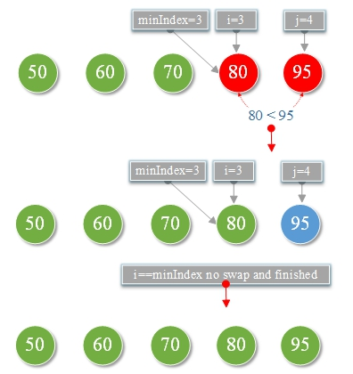

# Select sorting algorithm

## Select Sorting Algorithm:

Sorts an array by **repeatidely finding the minimum element from unsorted part and putting it at the beginning** .

1st sorting\

2nd sorting\

3rd sorting\

4th sorting\

