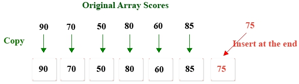

# Linear Table Append

1. Add a score $75$ to the end of the $1$-D array scores

## Analysis:

1. First create a temporary array(`tempArray`) larger than the original scores array
2. Copy each value of the scores to `tempArray`
3. Assign $75$ to the last index position `tempArry`