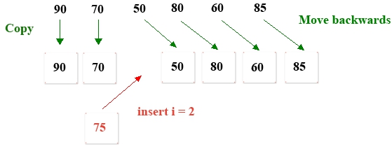

# Linear Table Insert

1. Insert a student's score anywhere in the $1$-D array scores

## Analysis

1. First create a temporary array `tempArray` larger than the original scores array length
2. Copy each value of the previous value of the scores array from the beginning to the insertion position to `tempArray`
3. Move the scores array from the insertion position to each value of the last element and move it back to `tempArray`
4. Then insert the score 75 to the index of the `tempArray` .
5. Finally assign the `tempArray` pointer reference to the scores;