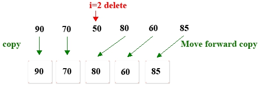

# Linear Table Delete

1. Delete the value of the `index = 2` from scores array

## Analysis

1. Create a temporary array `tempArray` that length smaller than scores by 1
2. Copy the data in front of `i = 2` to the front of the `tempArray`
3. Copy the array after `i = 2` to the end of the `tempArray`
4. Assign the `tempArray` pointer reference to the scores
5. Printout scores
