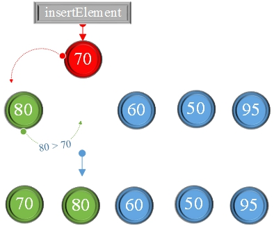
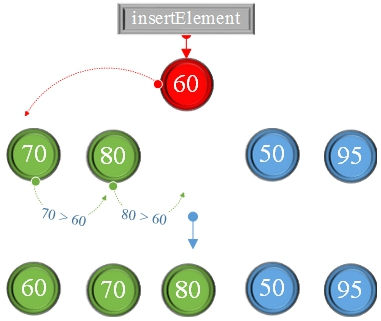
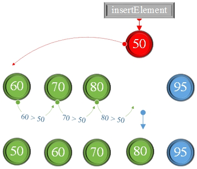
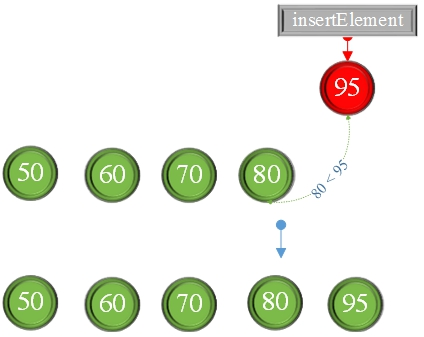

# Insert Sorting Algorithm

Insert Sorting Algorithm: Take an unsorted new element in the array, compare it with the already sorted element before, if the element is smaller than the sorted element, insert new element to the right position.

1st sorting\

2nd sorting\

3rd sorting\

4th sorting\

